# 안심케어 — ERD

팀 **공명** · 원본 DDL: `db/schema.sql` · 설계 근거: `docs/superpowers/specs/2026-09-07-ansimcare-design.md`

## 다이어그램

```mermaid
erDiagram
    GUARDIANS ||--o{ ELDERS : "보호"
    ELDERS ||--o{ CALLS : "통화"
    CALLS ||--o{ CALL_TRANSCRIPTS : "전사"
    CALLS ||--o| CALL_METRICS : "지표"
    CALLS ||--o| CALL_REPORTS : "요약"
    ELDERS ||--o{ ALERTS : "대상"
    GUARDIANS ||--o{ ALERTS : "수신"
    CALLS ||--o{ ALERTS : "근거"

    GUARDIANS {
        bigserial guardian_id PK
        text name
        text email UK
        text password_hash
        text phone_number
    }
    ELDERS {
        bigserial elder_id PK
        bigint guardian_id FK
        text name
        text phone_number UK
        time call_time
        timestamptz consent_at "NULL이면 발신 제외"
        real baseline_speech_ratio
        int baseline_avg_response_delay_ms
    }
    CALLS {
        bigserial call_id PK
        bigint elder_id FK
        text call_type "outbound|inbound"
        text channel "pstn|app"
        text status "scheduled|ringing|answered|completed|no_answer|failed"
        text provider_call_sid UK "전화망 통화만. 앱 통화는 NULL"
        text audio_key "S3, 30일 뒤 삭제"
        int duration_ms
        text error_code
    }
    CALL_TRANSCRIPTS {
        bigint call_id PK,FK
        int turn_index PK
        text speaker "ai|elder"
        text text
        int start_ms
        int end_ms
    }
    CALL_METRICS {
        bigint call_id PK,FK
        real speech_ratio
        real silence_ratio
        int turn_count
        int negative_word_count
        int avg_response_delay_ms "측정 불가면 NULL"
        int no_answer_recent_7
        int risk_score "VAD 실패면 NULL"
        text risk_level "normal|watch|alert"
        real baseline_speech_delta
        int baseline_delay_delta_ms
        bool degraded
        text calculator_version
    }
    CALL_REPORTS {
        bigint call_id PK,FK
        text summary "LLM이 쓴 문장"
        text model_id
    }
    ALERTS {
        bigserial alert_id PK
        bigint elder_id FK
        bigint guardian_id FK
        bigint call_id FK
        text alert_type
        text severity
        text message
        timestamptz sent_at
    }
```

## 이 스키마의 핵심 — 숫자와 문장을 테이블로 분리했습니다

`call_metrics`와 `call_reports`가 **따로 있는 것**이 설계 3.2의 구조적 표현입니다.

| 테이블 | 누가 만드나 | 성격 |
|---|---|---|
| `call_metrics` | **서버가 계산** (`MetricsCalculator`, 순수 함수) | 결정론적. 같은 오디오 → 항상 같은 값 |
| `call_reports` | **LLM** (CLOVA Studio) | 설명. 매번 달라져도 무방 |

원 기획안은 `emotion_analyses` 한 테이블에 `emotion_score`(LLM 산출)와 `summary`를 같이 담았습니다. 그러면 **"이 숫자를 누가 만들었나"가 흐려지고**, 리뷰하는 사람도 구현하는 사람도 헷갈립니다. 테이블을 나누면 스키마만 봐도 경계가 보입니다.

**`calculator_version`을 남깁니다.** 점수 가중치를 바꾸면 이전 점수와 비교할 수 없습니다. 어느 버전이 낸 점수인지 기록해야 추이 그래프가 거짓말을 하지 않습니다.

## 원 기획안 대비 변경

| 변경 | 없을 때 발생하는 문제 |
|---|---|
| **테이블 정의 순서 수정** | 원 DDL은 `elders`가 아직 정의되지 않은 `guardians`를 참조 → PostgreSQL은 전방 참조를 허용하지 않아 **실행 자체가 실패** |
| **`emotion_analyses` → `call_metrics` + `call_reports` 분리** | 서버가 계산한 숫자와 LLM이 쓴 문장이 한 테이블에 섞임 |
| **`calls.status` 신설** | 미응답·발신실패를 표현할 수 없었음 (`ended_at` NULL로만 추정) |
| **`elders.consent_at` 신설** | 동의 기록이 없었음 (설계 3.6) |
| **`elders.baseline_*` 신설** | 개인 기준선 저장처가 없어 "평소 대비 변화" 판정이 불가능 |
| **`calculator_version` 신설** | 가중치 변경 후 옛 점수와 섞여 추이가 왜곡됨 |

## 제약으로 막는 것들

DB가 지켜주면 애플리케이션 버그가 데이터를 오염시키지 못합니다.

| 제약 | 막는 상황 |
|---|---|
| `calls_completed_requires_audio` | 통화가 끝났다는데 분석할 오디오가 없음 → **파이프라인이 조용히 멈춤** |
| `calls_error_requires_failure` | `status='completed'`인데 `error_code`가 붙어 있음 |
| `calls_app_has_no_provider_sid` | 앱 통화에 전화 사업자 SID가 붙음 → **채널을 잘못 기록한 것** |
| `calls_app_cannot_be_no_answer` | 앱 통화가 `no_answer` → 어르신이 직접 누른 통화라 성립 불가. **미응답 지표 오염을 막음** |
| `metrics_score_and_level_together` | 점수만 있고 등급이 없거나 그 반대 |
| `transcript_span_is_forward` | `end_ms < start_ms`인 전사 구간 |
| `risk_score BETWEEN 0 AND 100` | 범위를 벗어난 점수 |
| `speaker IN ('ai','elder')` | 정의되지 않은 화자 |
| `PRIMARY KEY (call_id, turn_index)` | 대화 순서 중복 |

## 인덱스 설계 근거

| 인덱스 | 타는 쿼리 |
|---|---|
| `elders_due_idx` (부분) | 스케줄러가 "지금 걸 어르신" 조회 — **동의 안 한 분은 인덱스에 아예 없음** |
| `calls_elder_idx` | 통화 이력 목록, 위험 추이 그래프 |
| `calls_pending_idx` (부분) | 워커 재시작 시 미완료 통화 회수 |
| `call_metrics_risk_idx` | 위험 등급별 조회 (보호자 대시보드, 복지사 확장용) |
| `alerts_guardian_idx` | 보호자별 알림 목록 |
| `alerts_unsent_idx` (부분) | 발송 워커가 미발송 건만 집어감 |

## 설계와의 연결점

- **`avg_response_delay_ms`가 nullable인 것은 의도**입니다. 어르신이 한 번도 응답하지 않으면 `None`이며, 0으로 두면 "즉답"과 구분되지 않아 평균이 왜곡됩니다.
- **`risk_score`가 nullable인 것도 의도**입니다. VAD가 실패하면 임의 점수를 만들지 않고 `NULL` + `degraded=true`로 둡니다(설계 8장).
- **미응답은 실패가 아니라 지표**입니다. `status='no_answer'`로 기록되고 `no_answer_recent_7`을 통해 위험 점수에 반영됩니다.

## 아직 정하지 않은 것

- **오디오 보관 주기 구현** — 설계 3.6은 30일 뒤 삭제인데, S3 라이프사이클로 할지 배치로 할지 미정. `calls.audio_key`를 NULL로 되돌리는 처리도 필요합니다.
- **기준선 갱신 주기** — 최근 몇 회의 이동 평균으로 할지, 언제 갱신할지.
- **알림 재발송 억제** — 같은 위험이 며칠 이어질 때 매일 보낼지.
