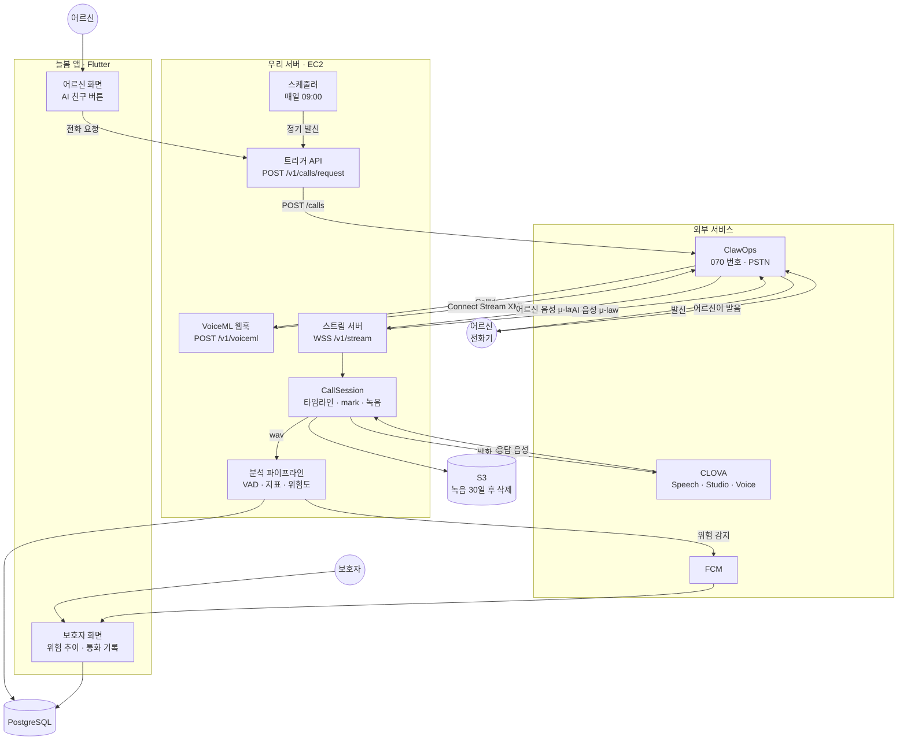
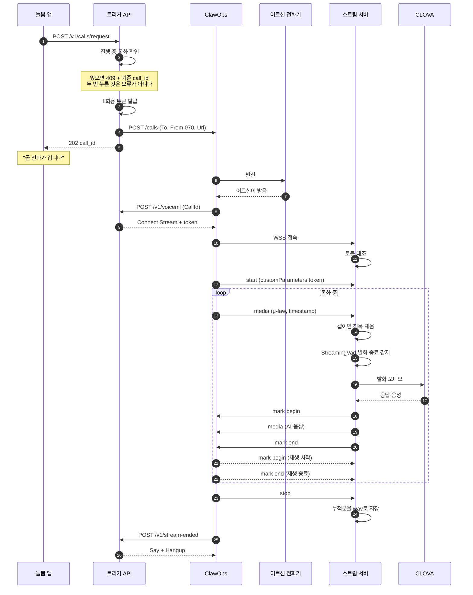
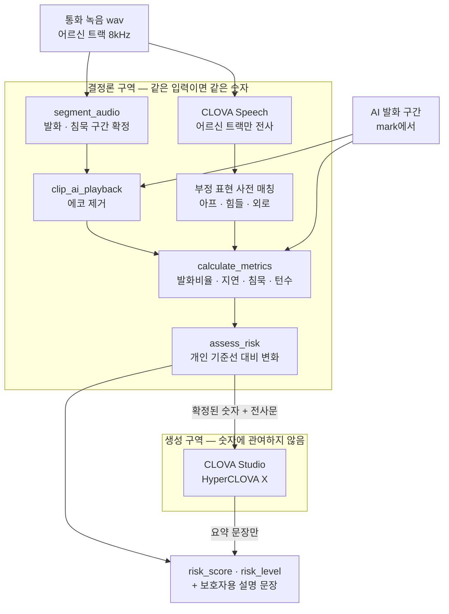
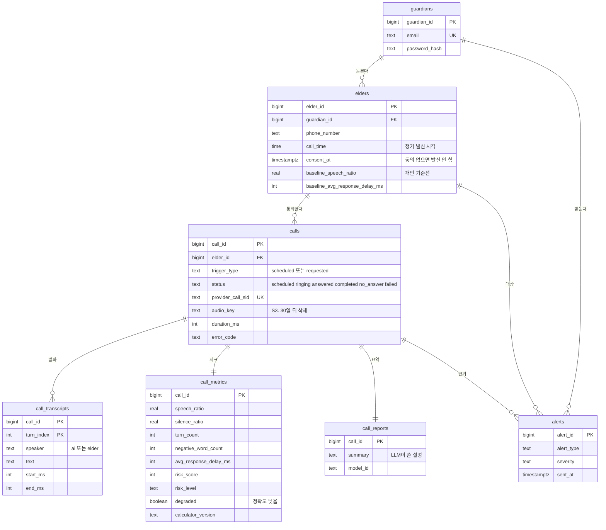
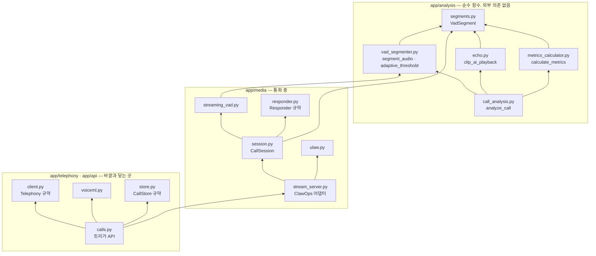
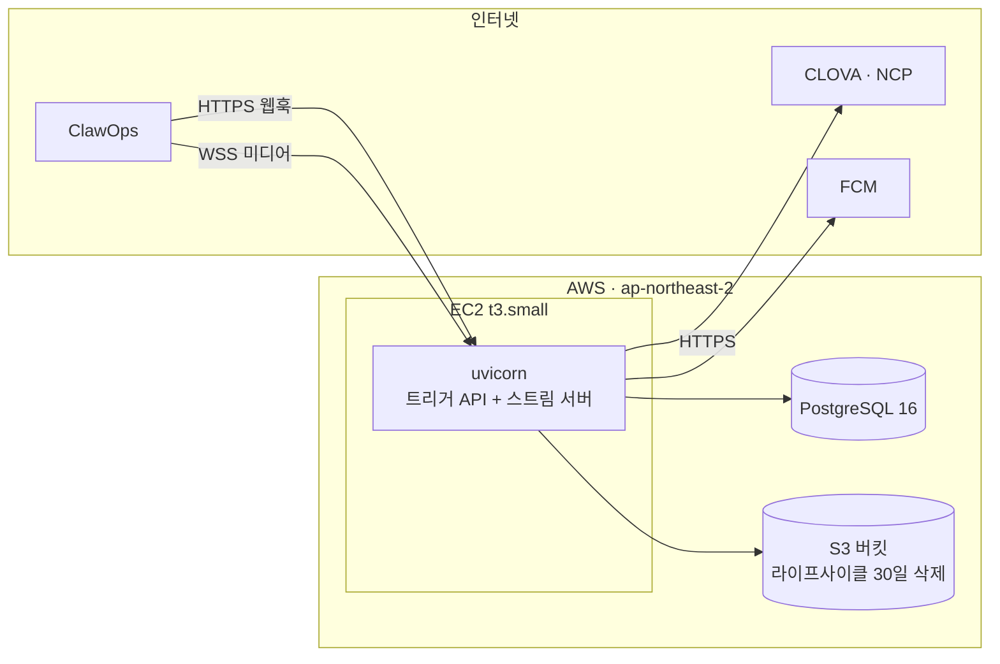
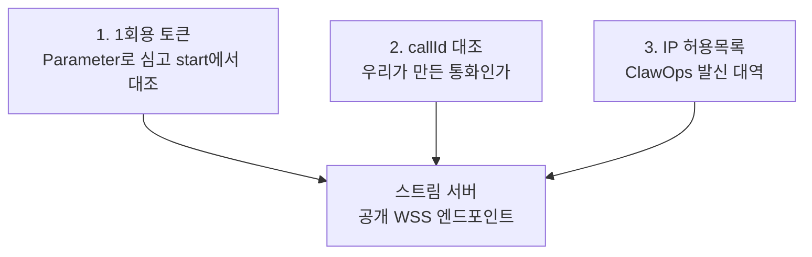

# 안심케어 — 시스템 설계도

- **팀명:** 공명
- **작성일:** 2026-09-15
- **기준:** `2026-09-15-pstn-call-design.md` (전화망 단일 채널)

> 한 장에 다 넣으면 읽을 수 없으므로 관점별로 나눕니다. 1장이 전체, 2장이 시간 흐름, 3장이 이 프로젝트의 간판(결정론), 4~6장이 데이터·코드·인프라입니다.

---

## 1. 전체 구성



**핵심은 `ClawOps → 스트림 서버` 화살표가 어르신 음성 하나뿐이라는 것입니다.** AI 음성은 우리가 보냅니다. 이 비대칭이 곧 화자 분리이고, Asterisk를 걷어낸 근거입니다.

---

## 2. 통화 한 통 — 시간 순서



**`mark`가 두 번 오가는 것이 이 그림의 요점입니다.** 우리가 보낸 시각이 아니라 **되돌아온 시각**이 AI 발화 구간이고, 그 시각은 직전 `media.timestamp`에서 읽습니다. 벽시계를 쓰면 재현성이 깨집니다.

---

## 3. 분석 파이프라인 — LLM은 숫자를 만들지 않는다

이 프로젝트의 간판입니다. 감정 점수를 LLM이 산출하면 같은 대화에 오늘 62점 내일 71점이 나오고, **추이 그래프가 노이즈가 되어 보호자는 알림을 무시하게 됩니다.**



```python
def test_score_is_identical_across_repeated_runs():
    scores = {assess_risk(metrics, ...).risk_score for _ in range(100)}
    assert len(scores) == 1
```

**같은 입력 100회 → 점수 편차 0.** 이 테스트가 위 그림의 경계를 코드로 증명합니다.

### 지표와 출처

| 지표 | 가중치 | 출처 | 화자 분리가 필요한가 |
|---|---|---|---|
| 발화 비율 | 35 | VAD | **필요** — 어르신 트랙만 |
| 평균 응답 지연 | 25 | VAD + mark | **필요** — AI 종료 시각 |
| 부정 표현 빈도 | 20 | 전사문 | 필요 — 어르신 발화만 |
| 미응답 이력 | 20 | 통화 기록 | 불필요 |
| 침묵 비율 · 발화 턴 수 | 보조 | VAD | 필요 |

**100점 중 60점이 화자 분리 위에 서 있습니다.** ClawOps 스트림이 이걸 주기 때문에 Asterisk가 필요 없어졌습니다.

---

## 4. 데이터 모델



**설계에서 지킨 것 셋**

- `call_metrics.calculator_version` — 계산식이 바뀌면 과거 점수와 비교하면 안 된다는 것을 **데이터가 스스로 말하게** 한다
- `call_metrics.degraded` — 분석 품질이 낮을 때 실패로 처리하지 않고 정직하게 표시한다
- `elders.consent_at` — 동의 없이는 발신하지 않는다 (설계 3.6). 인덱스도 `WHERE consent_at IS NOT NULL`

> `calls.trigger_type`은 계획 Task 2에서 적용됩니다. 현재 스키마에는 아직 `channel`이 있습니다.

---

## 5. 코드 모듈 의존



**화살표가 위로만 갑니다.** 아래층(`analysis`)은 위층을 모릅니다. 그래서 분석 코어는 클라우드도 네트워크도 없이 로컬에서 전부 테스트됩니다.

**`CallSession`이 `stream_server`를 모른다**는 점이 중요합니다. 앱 WebSocket용으로 만든 코드가 전화망에서 그대로 재사용됐습니다 — 프레임 출처만 바뀌었습니다.

### 규약으로 분리한 것

| 규약 | 진짜 구현 | 가짜 구현 | 왜 |
|---|---|---|---|
| `Responder` | `ClovaResponder` | `CannedResponder` | NCP 신청 전에 통화 경로 완성 |
| `Telephony` | `ClawOpsTelephony` | `FakeTelephony` | ClawOps 계정 전에 트리거 API 완성 |
| `CallStore` | PostgreSQL | `InMemoryCallStore` | DB 연결 전에 API 완성 |
| `CallRegistry` | PostgreSQL | `InMemoryCallRegistry` | 〃 |

**외부 의존을 전부 뒤로 미룰 수 있게 만든 것**이 이 프로젝트의 진행 방식입니다.

---

## 6. 인프라



| 항목 | 선택 | 월 비용 |
|---|---|---|
| 전화망 | ClawOps **Individual** (100분 포함) | ₩19,000 |
| 서버 | EC2 (미디어 서버 겸 API) | 약 ₩18,000 |
| STT/TTS/LLM | CLOVA Speech · Voice · Studio | 사용량 — NCP 신청 후 |
| **합** | | **약 ₩37,000 + CLOVA** |

**쓰지 않는 것** — ClawOps SIP 애드온(₩99,000), ClawOps 전사(₩10/분), ClawOps AI 에이전트(₩30~140/분), AWS Chime SDK SIP, Asterisk

> Individual은 **초과 과금이 아니라 그냥 멈춥니다.** 시연 달에는 Business(₩99,000 / 1,000분)로 올립니다.

---

## 7. 보안과 개인정보



ClawOps는 스트림 소켓에 서명을 걸지 않습니다. 그래서 **3중으로 막습니다.** 토큰은 1회용이며, 재사용되면 같은 통화에 두 스트림이 붙습니다.

| 대상 | 정책 |
|---|---|
| 통화 원본 오디오 | S3 라이프사이클로 **30일 후 삭제**. 저장소에는 절대 안 들어감 (`.gitignore`) |
| 전사문 · 지표 | 보존 — 추이 분석의 근거 |
| 발신 | `elders.consent_at`이 없으면 **발신하지 않음** |
| 비밀 | `google-services.json`, `.env` 커밋 금지 |

---

## 8. 지금 어디까지 왔나

| | 상태 |
|---|---|
| 설계 · 전화 경로 조사 | 완료 (5판 — ClawOps Stream) |
| DB 스키마 | 완료 — 컨테이너 검증. `trigger_type` 변경 대기 |
| `VadSegmenter` · `MetricsCalculator` | 완료 — 8kHz 결함 수정, 재현성 테스트 통과 |
| `StreamingVad` · `CallSession` | 완료 — 전화망용 수정 대기 |
| 앱 (늘봄) | 완료 — 대기 화면 재작성 대기 |
| **전화망 통화** | **계획 완료, 구현 대기** (11개 태스크) |
| `ClovaResponder` | 선결 조건 2건 기록됨 |
| 스케줄러 · S3 · 알림 | 예정 |
